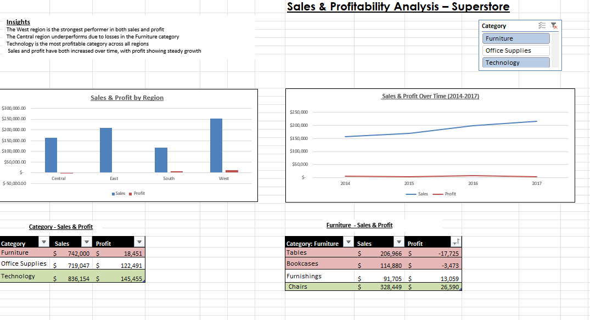

# vigilant-o
Sales data analysis using Excel, exploring revenue trends, product performance, and regional insights through an interactive dashboard
# Superstore Sales Analysis (Excel Dashboard)

## Overview
This project analyses retail sales data using Microsoft Excel to identify trends in revenue, profitability, and customer behaviour. The goal was to extract meaningful insights and present them through a structured dashboard.

## Tools Used
- Microsoft Excel  
- PivotTables  
- Charts and dashboard design  
- Data cleaning and formatting  

## Dataset
The dataset contains transactional sales data including:
- Order Date  
- Region and State  
- Category and Sub-Category  
- Sales and Profit  
- Quantity and Discount  
- Customer Segment  

## Key Analysis Performed
- Sales performance by region and category  
- Profitability analysis across products  
- Monthly sales trends  
- Impact of discounts on profit  
- Customer segment analysis  

## Key Insights
- Some high-sales products generate low profit due to heavy discounting  
- Sales performance varies significantly across regions  
- Discounts negatively impact profit margins  
- A small number of products contribute most of the revenue  

## Dashboard Features
- KPI summary (Total Sales, Total Profit)  
- Sales by region  
- Profit by category  
- Monthly sales trends  
- Customer segment breakdown  

## Dashboard Preview

